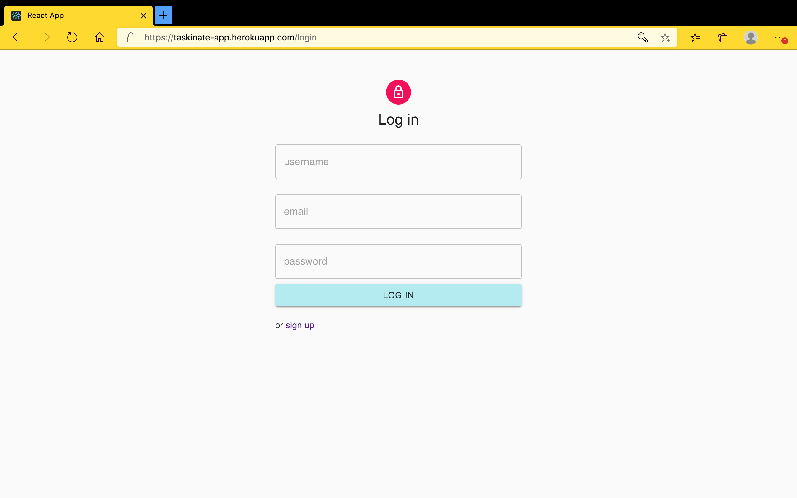
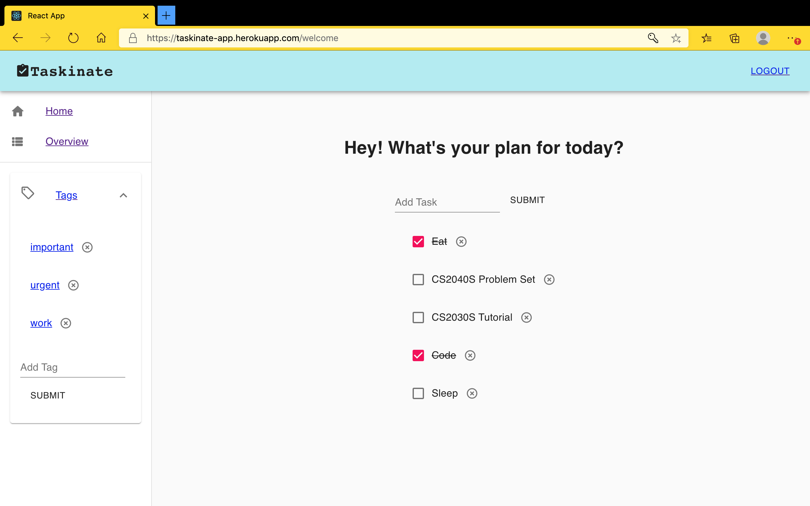
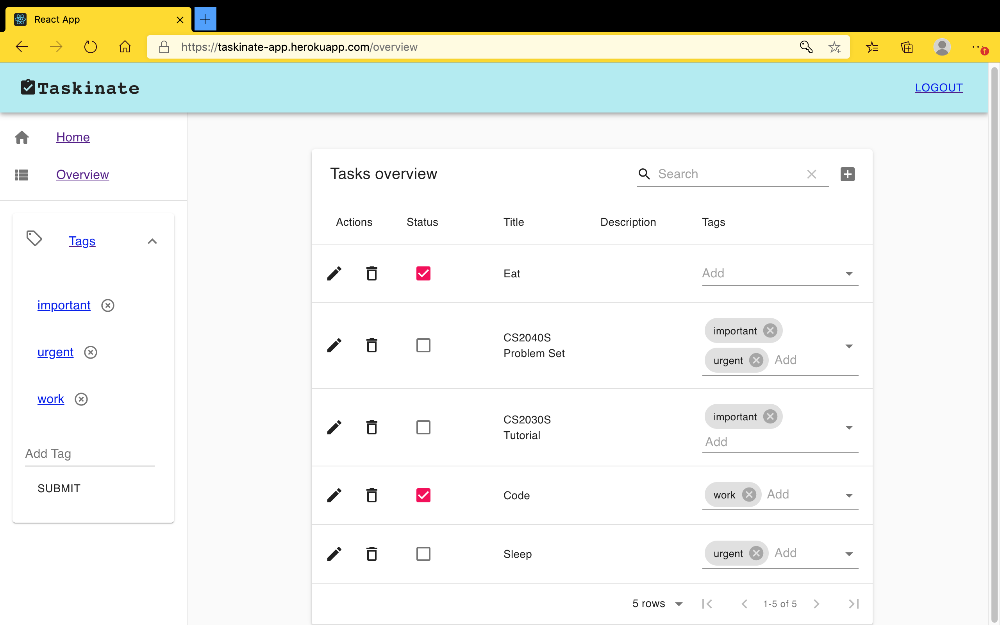
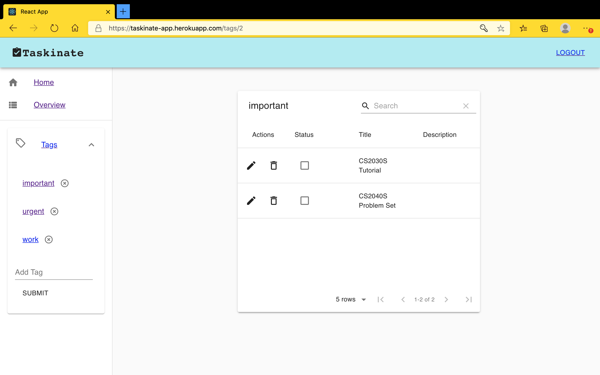

<h1 align="center"> Taskinate </h1>
<h3 align="center"> Simple todo, simple life </h3>

<p align="center"> Name: Zhang Ziqing, Matriculation Number: A0223145R </p>
<p align="center"> Try the <a href="https://taskinate-app.herokuapp.com">production version</a><p>

## Overview

Taskinate is a todo list that aims to make people's life easier. Nowadays many todo list apps
are equipped with increasingly more features which actually causes more anxiety for anxious
people who are looking for simple application to record down their tasks in an effective way.
In light of this, Taskinate provides a simple solution using tasks and tags features without
overwhelming its users, with the belief that beautiful todo list applications should remain simple yet powerful.

<br/>
<p align="center">&nbsp;&nbsp;&nbsp;&nbsp;&nbsp;&nbsp;&nbsp;</p>
<p align="center">&nbsp;&nbsp;&nbsp;&nbsp;&nbsp;&nbsp;&nbsp;</p>
<br/>

## Final submission

The final submission can be found in `final-submission` folder.

## Note

This app was develpoed on macOS Mojave 10.14 only. Moreover, the production version is running on FireFox 85.0 and Microsoft Edge 84.0.522.44.
It does not support Chrome yet due to potential issues with cookies setting (only able to sign up, log in and sign out, but cannot perform the other features).

## Features

1. Sign up and login with username, email and password.
2. Create, retrieve, update and delete tasks and tags.
3. Check or uncheck tasks depending on its status.
4. Tag tasks in Overview page.
5. Filter tasks according to tags.
6. Search tasks by name in the overview table.

## Main sections

- Home
  The welcome page of the simplest list of task titles.
- Tags
  The sidebar list of tags in the current account. Click on each tag to view the tagged tasks accoridngly.
- Overview
  The detailed page of tasks and tags. Edit, check, delete, and tag tasks.

## Structure

`taskinate-todo-list` contains two submodules:

1. Frontend React code can be found at `taksinate-app` submodule, hosted at [https://taskinate-app.herokuapp.com/](https://taskinate-app.herokuapp.com/)
2. Backend Ruby on Rails code can be found at `taksinate-api` submodule, hosted at [https://taskinate-api.herokuapp.com/](https://taskinate-api.herokuapp.com/)

## Get it running

1. To clone the git repository with submodules to local address, please use this command:

```git
git clone --recursive https://github.com/ziqing26/taskinate-todo-list.git
```

2. Unzip the folder, open the terminal to change directory to the folder.

## Setup Taskinate API

1. Make sure your local environment has:

- Rails 6.0.3.4
- Ruby 2.7.2
- Postgres

2. In the rails root directory `taksinate-api`, run

```git
bundle install
```

3. Then execute:

```git
bundle exec rails db:create
bundle exec rails db:setup
```

to create and setup database. 4. Start the rails server:

```git
bundle exec rails s
```

The api server is now on [http://localhost:5000](http://localhost:5000)

## Setup Taskinate frontend

Change all axios.defaults.baseURL to [http://localhost:5000](http://localhost:5000) before proceed.

In the project directory `taksinate-app`, you can run:

### `yarn start`

Runs the app in the development mode.\
Open [http://localhost:3000](http://localhost:3000) to view it in the browser.

The page will reload if you make edits.\
You will also see any lint errors in the console.

### `yarn test`

Launches the test runner in the interactive watch mode.\
See the section about [running tests](https://facebook.github.io/create-react-app/docs/running-tests) for more information.

### `yarn build`

Builds the app for production to the `build` folder.\
It correctly bundles React in production mode and optimizes the build for the best performance.

The build is minified and the filenames include the hashes.\
Your app is ready to be deployed!

See the section about [deployment](https://facebook.github.io/create-react-app/docs/deployment) for more information.
